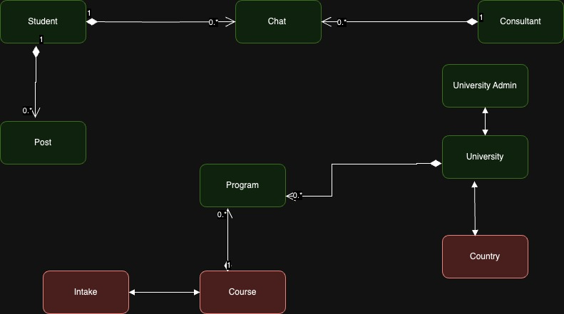

# PanoramaEd  (Global Education Helper Platform)
 
## Project Overview

PanoramaEd is a revolutionary web app designed to empower students in their pursuit of the perfect international college experience. Our platform offers a comprehensive suite of features tailored to guide and support students through every step of their journey toward higher education abroad. Whether you're exploring universities, researching programs, seeking admission advice, or sharing your educational journey, this platform is your go-to destination.
 
 
## Key Entities
 

### 3. Chat Model

## Attributes

### Message Schema

- `authorId`: String, required - Unique identifier of the message author.
- `authorName`: String, required - Full name of the message author.
- `messageBody`: String, required - The content of the message.
- `timeStamp`: String, required - Timestamp indicating when the message was sent.

### Chat Schema

- `studentId`: String, required - Unique identifier for the student involved in the chat.
- `consultantId`: String, required - Unique identifier for the consultant involved in the chat.
- `messages`: Array of objects, each object having the following properties:
  - `authorId`: String, required - Unique identifier of the message author.
  - `authorName`: String, required - Full name of the message author.
  - `messageBody`: String, required - The content of the message.
  - `timeStamp`: String, required - Timestamp indicating when the message was sent.

### 4. University Admin

- **Fields:**
  - `id`: Unique identifier for the university administrator.
  - `university`: University associated with the administrator.

### 5. Program

- **Fields:**
  - `id`: Unique identifier for the program.
  - `fee`: Tuition fee for the program.
  - `ranking`: Ranking of the program.
  - `college`: College offering the program.
  - `collegeAddress`: College address.
  - `collegeLogo`: College logo.
  - `course`: Associated course for the program.
  - `requirements`: Admission requirements for the program.

### 6. Post

- **Fields:**
  - `_id`: Unique identifier for the post.
  - `author`: name of the author who has posted
  - `title`: title of the post
  - `text`: Content of the post.
  - `upVote`: Number of votes received.
 

### 7. Intake

- **Fields:**
  - `year`: Academic year associated with the intake.
  - `semester`: Semester associated with the intake.

### 8. Course

- **Fields:**
  - `name`: Name of the course.
  - `details`: Additional details about the course.

### 9. College

- **Fields:**
  - `name`: Name of the college.
  - `address`: College address.
  - `logo`: College logo.
  - `admissionLink`: College link for admission.
  - `ranking`: College ranking.
  - `state`: state of the College.
  - `yearEstd`: year of establistion of the college.
  - `country`: coutry in which college located.
  - `programs`: programs under the college.
  - `upcomingEvents`: upcoming events by the college.
  - `shortlistedStudents`: student ids who shortlisted the college.

## Features
 
1. Explore Colleges Worldwide
- Browse and research information about universities globally.
- Explore detailed program descriptions, fees, and admission requirements.

2. Consultation with Experienced Consultants
- Connect with experienced consultants for personalized advice.
- Engage in one-on-one chats to address your academic queries.
 
3. College Predictor
- Evaluate your chances of getting admitted to a particular university based on your profile.

4. Dynamic College Comparison
- Make confident comparison with our intuitive comparison tools
- 
 
5. Student driven insights
- panoramaEd provides a platform for students to share their admission journey and communicate through posts.
 
6. Multilingual support
- PanoramaEd transcends language barriers, offering support in multiple languages.

7. Chat with consultant
- If you have any queries you can chat with the consultant to resolve your doubts.

### Develeopment and Execution
- clone the repo repository on your local system
- import the repository on to IDE and go to the repository path in the terminal
- perform below steps in both 'client' and 'server' folders of the repository. 'client' folder contains code for UI and 'server' folder contains code for backend
1. Run `npm i`.
2. Run `npm start`.
3. The PanoramaEd App should be accessible at `http://localhost:3000`.

APIs Backend:

Find college by name can be accessed at GET: `http://localhost:3001/colleges/name/${collegeName}`
to shortlist a college PUT: `http://localhost:3001/colleges?studentId=${student._id}&collegeId=${collegeData?._id}`
college suggest can be fetched by POST : `http://localhost:3001/programs/suggest`, additionally you have to send student metrics object in body.
API to GET all posts can be accessed at  `http://localhost:3001/posts`
API to POST a new Student post can be accessed at `http://localhost:3001/posts/`
API to DELETE a Student post can be accessed at `http://localhost:3001/posts/${id}`
API to PATCH (update upVote field ) in the post can be accessed at `http://localhost:3001/posts/${id}/?upvote=${upVote+1}`
API to get Student Details `http://localhost:3000/studentdetails`

 
